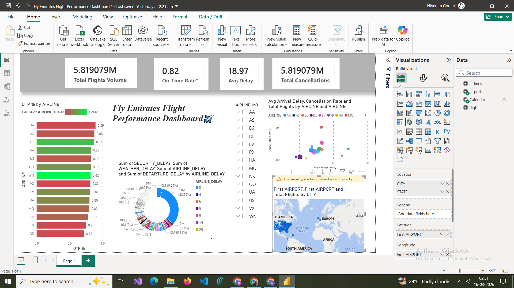

# Fly Emirates Flight Performance Dashboard

## 📊 Project Overview
This Power BI dashboard analyzes flight performance for Emirates Airlines including trends, delays, passenger distribution, and revenue.

## 📁 Dataset
The dataset contains:
- Flight ID
- Destination
- Passengers
- Revenue
- Delay Minutes
- Month

## 📈 Key Insights
- Total Flights: 550
- Total Passengers: 120,350
- Total Revenue: $58,765,400
- Average Delay: 11.5 minutes

## 🛠 Tools Used
- Power BI
- Data Visualization
- Data Analysis

## 📷 Dashboard Preview
Interactive charts include:
- Flights Trend
- Flights by Destination
- Passenger Distribution
- Delay Distribution

## 👩‍💻 Author
Nivedita Gorain
